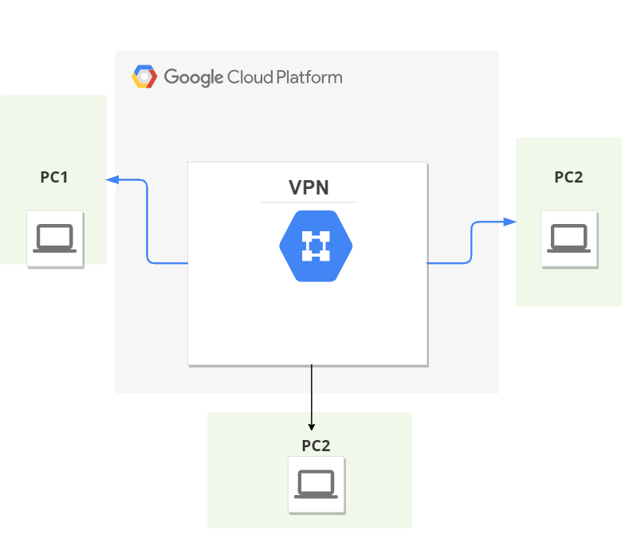
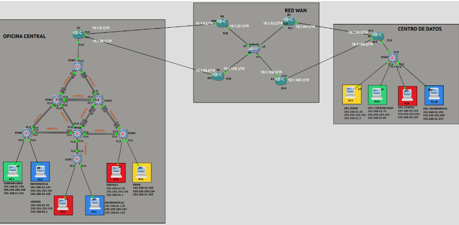
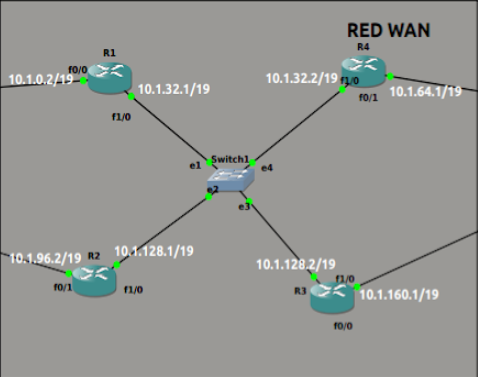
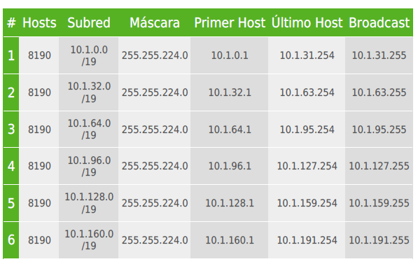
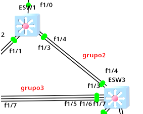
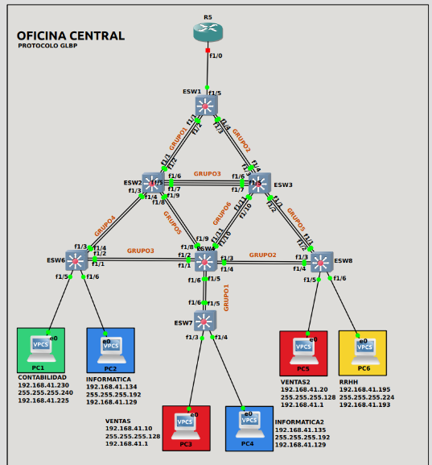
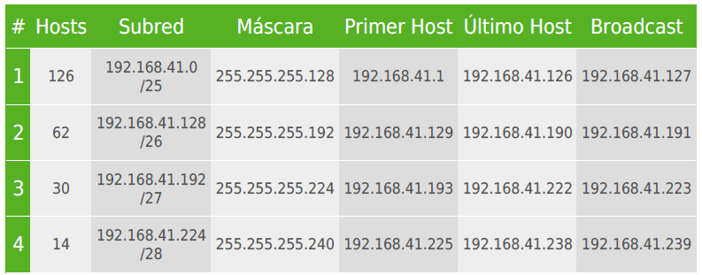
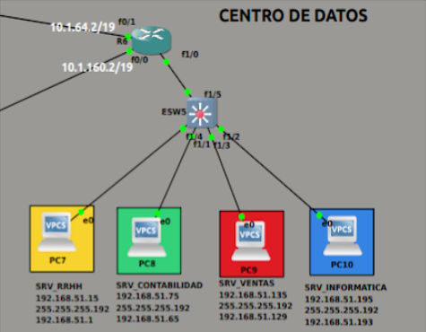

>
>
> Universidad San Carlos de Guatemala
>
>Facultad de Ingeniería 
>Escuela de Ciencias y Sistemas 
>Primer Semestre, 2022
>
>Laboratorio de Redes de Computadoras 1

### Grupo No.1

Integrantes:


## <center> DATOS DE LOS ESTUDIANTES </center>
| Nombre                               | Carnet     |  
| ------------------------------------ | ---------  | 
| José Ignacio Martinez Hernandez      |  201408507 | 
| Luis Roberto Boror Yoc               |  201403517 | 
| Erick Javier Bernal Orellana         |  201480017 | 
| Claudia Iovana Miranda Alvarez       |  201700387 | 
---
<br>


 <h1 align="center" > PROYECTO 2</h1>


<div id='content'/>

## CONTENIDO

1. [DESCRIPCION](#id1)
2. [RED FISICA](#id2)
3. [TOPOLOGIA 1](#id3)
4. [TOPOLOGIA 2](#id4)
5. [TOPOLOGIA 3](#id5)

<div id='id1'/>

## 1. DESCRIPCION  [ ⇧](#content)
<div class=''text-justify''>
La empresa “Libros Real S.A”, nos ha contratado para la siguiente configuración que les servirá para organizar de manera segura y eficiente los diferentes departamentos con los que cuenta la empresa, en dos distintos lugares de trabajo; uno de esos lugares es el centro de datos y el otro es la oficina central la cual está próxima a inaugurarse.

Para este caso el centro de datos consta con 4 servidores, el servidor web de ventas, de contabilidad, de recursos humanos e informática, los cuales se encuentran
en subredes diferentes como se muestra en la topología del centro de datos.

La empresa quiere implementar una topología de red para comunicarse desde la
oficina central con el centro de datos.

Los administradores, la base de datos y los servidores web deben de estar en
VLAN diferentes cada uno.

Se debe de proveer la siguiente configuración en la red para cumplir con las
expectativas y requerimientos que la empresa necesita:

- Garantizar que el servidor de contabilidad sea solo accedido por usuarios del departamento de contabilidad y el servidor de recursos humanos sea solo accedido por usuarios del departamento de recursos humanos.

- Garantizar que el servidor web de e-commerce sea accedido solo por los usuarios de ventas.

- Garantizar que el servidor de informática sea accedido únicamente por usuarios del departamento de desarrollo.

- Garantizar la comunicación de los administradores con todos los servidores web.
 </div>
<div id='id2'/>

## 2. RED FISICA [ ⇧](#content)
Para el Proyecto 2, nos hemos apoyado de las herramientas:

<p align="center">
     
</p>


Para darle solucion a este problema, conectaron 3 computadoras fisicas por medio de la VPN formando una pequeña red donde estas tienen conexión y acceso a propiedades de red tradicionales como archivos compartidos, y muchas cosas mas por defecto. A continuacion se muestra el grafico que describe nuestra Red Fisica:

<p align="center">
  
</p>

# TOPOLOGIA GENERAL
en esta parte se encuentra la funcionalidad general.
<p align="center">
  
</p>


<div id='id3'/>

## 3. TOPOLOGIA 1  [ ⇧](#content)
Se realizo el cálculo de subredes de la red 10.1.0.0/16, y se obtuvieron las subredes necesarias para conectar toda la red.
- Se asignaron las direcciones IP a cada uno de los router.
- Se configuraron las rutas estáticas necesarias en los routers para que sea posible establecer la comunicación del centro de datos y la oficina central.
- Se configuro el protocolo de redundancia GLBP.
- Se configuro protocolo de redundancia HSRP.

### Red WAN (Interconexión de centro de datos y oficina central)
```sh
Imagen descriptiva de la Topologia 1
```
<p align="center">
  
</p>

```sh
Para esta red se realizo el calculo FLSM que se describe en la siguiente tabla: 
```
<p align="left">
  
</p>

```bat
CONFIGURACIONES ESW1
#ESW1
    #CONFIGURACIÓN VTP
    conf t
    vtp domain redes1gp1
    vtp password redes1gp1
    vtp mode server
    vtp version 2
    #comprobar la configuración
        sh vtp st

  # configuración de VLAN
	conf t
	vlan 10
	name RHUMANOS
	vlan 20 
	name CONTABILIDAD
	vlan 30
	name VENTAS
	vlan 40
	name INFORMATICA
```

```bat
#CONFIGURACION DE ESW1 F1/10 EN MODO TRUNK
    conf t
    int f1/0
    switchport mode trunk
    switchport trunk allowed vlan 1,10,20,30,40,1002-1005
    sh int tr
```

```sh
  # configuración de port channel en cada bloque de conexiones.
# consejos:
	# repetir la configuración, para cada bloque de port channel
	#en simultáneo para evitar que falle
	# Solo falta cambiar para cada configuración la interfaz(f1/ 3 - 4) correspondiente
# Para “channel-group # mode on”, el número indica el número del texto en rojo

 ```
<p align="left">
  
</p>

<div id='id4'/>

## 4. TOPOLOGIA 2  [ ⇧](#content)

### Oficina Central

Dentro de la oficina central se encuentran cuatro departamentos:
  - Recursos Humanos
  - Contabilidad
  - Ventas
  - Bases de datos.


El departamento de recursos humanos cuenta con: 
  - 1 Gerente
  - 15 Reclutadores
  - 5 Analistas de recursos humanos.


El departamento de contabilidad es el más pequeño y actualmente cuenta con:
  - 1 Gerente
  - 5 asistentes de contabilidad 
  - 1 contador en general 
  - 1 auditor

El departamento ventas es el departamento más grande, la empresa prevé un crecimiento de hasta un 32%, cuenta con:
  - 76 Operadores de ventas
  - 4 Encargados de cuentas
  - 12 Managers
  - 1 gerente

  
En el departamento de informática se prevee un crecimiento hasta un 18% por lo que se considero el crecimiento de la Red, cuenta con:
  - 15 Programadores
  - 5 Gestores de proyectos
  - 1 Administrador de la base de datos
  - 3 Analistas de infraestructura
  - 6 Testers
  - 1 Gerente


```sh
Imagen descriptiva de la Topologia 2
```
<p align="center">
  
</p>


```sh
Para esta red se realizo el calculo VLSM que se describe en la siguiente tabla: 
```
<p align="left">
  
</p>

`

<div id='id5'/>

##  TOPOLOGIA3 [ ⇧](#content)


### Centro de Datos
Para esta topologia ise utilizo la red 192.168.51.0/24 la cual se administro en subredes para los departamentos que se mensionaron anteriormente.


 
  - Se crearon las VLANs correspondientes para realizar la configuración de los puertos, asignando el modo y VLAN correspondientes.
  - Se configuraron las rutas estáticas necesarias en R1 para que sea posible establecer comunicación entre el centro de datos y la oficina central


```sh
Imagen descriptiva de la Topologia 3
```
<p align="center">
  
</p>


```sh
Para esta red se realizo el calculo que se describe a continuacion: 
192.168.51.0/24
```
<p align="left">
  
</p>


<div id='id6'/>

##  TOPOLOGIA3 [ ⇧](#content)


```sh
ACCESS
```
<p align="left">
  
</p>


```sh
VLANs
```
<p align="left">
  
</p>


```sh
INTERVLANs
```
<p align="left">
  
</p>


```sh
RUTAS
```
<p align="left">
  
</p>


```sh
VPC1
```
<p align="left">
  
</p>

```sh
VPC2
```
<p align="left">
  
</p>

```sh
VPC3
```
<p align="left">
  
</p>

```sh
VPC4
```
<p align="left">
  
</p>